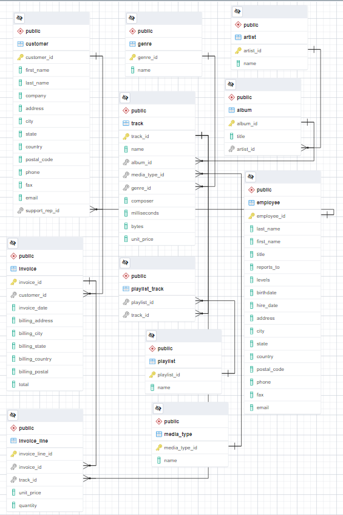

# Music Store Data Analysis

We have been provided tracks and sales data from a digital music store.

After downloading the dataset we open the data file in Excel to take a quick look. The dataset includes several tables on invoice information, tracks, albums, artists and genres as well as employee and customer information related to the store's sales.

We opened each of the 11 files in Excel and verified that there were no missing data points and nulls. Also, renamed few columns to make all of them lowercase.

Next, we loaded data files into pgAdmin using Import data feature and quickly checked few random table counts and matched them with the data in Excel files.

```sql
select count(*) from artist;
select count(*) from employee;
select count(*) from genre;
select count(*) from invoice_line;
select count(*) from track;
```

## Schema
Here is the database schema as exported from pgAdmin's ERD tool.




## Data Analysis
### Q1. What is total number of songs in the library?
```sql
SELECT COUNT(*) as total_songs FROM track;
```
| total_songs |
|--------|
| 3503     |


### Q2. What is the distribution of tracks over genres?

```SQL
SELECT
    g.name as genre,
    COUNT(t.track_id) AS num_tracks
FROM track AS t
JOIN genre AS g
  ON t.genre_id = g.genre_id
GROUP BY g.name
ORDER BY num_tracks DESC;
```

| genre              | num_tracks |
|--------------------|------------|
| Rock               | 1297       |
| Latin              | 579        |
| Metal              | 374        |
| Alternative & Punk | 332        |
| Jazz               | 130        |
| TV Shows           | 93         |
| Blues              | 81         |
| Classical          | 74         |
| Drama              | 64         |
| R&B/Soul           | 61         |


### Q3. Find list of top 10 Rock artists ordered by their number of songs

```sql
SELECT  
    artist.artist_id, 
    artist.name, 
    COUNT(*) AS number_of_songs 
FROM track AS t 
INNER JOIN album AS a
    ON t.album_id = a.album_id
INNER JOIN artist
    ON a.artist_id = artist.artist_id
INNER JOIN genre AS g 
    ON t.genre_id = g.genre_id
WHERE g.name LIKE '%Rock%'
GROUP BY artist.artist_id
ORDER BY number_of_songs DESC
LIMIT 10;
```

| artist_id | name                         | number_of_songs |
|-----------|------------------------------|-----------------|
| 22        | Led Zeppelin                 | 114             |
| 150       | U2                           | 112             |
| 58        | Deep Purple                  | 92              |
| 90        | Iron Maiden                  | 81              |
| 118       | Pearl Jam                    | 54              |
| 152       | Van Halen                    | 52              |
| 51        | Queen                        | 45              |
| 142       | The Rolling Stones           | 41              |
| 76        | Creedence Clearwater Revival | 40              |
| 52        | Kiss                         | 35              |


### Q4. Find top 10 longest the tracks that have duration longer than the average song length

```sql
SELECT 
    name,
    (milliseconds / 1000 / 60) as length_minutes
FROM track
WHERE milliseconds > (SELECT AVG(milliseconds) FROM track)
ORDER BY milliseconds DESC
LIMIT 10;
```

| name                        | length_minutes |
|-----------------------------|----------------|
| Occupation / Precipice      | 88             |
| Through a Looking Glass     | 84             |
| Greetings from Earth, Pt. 1 | 49             |
| The Man With Nine Lives     | 49             |
| Battlestar Galactica, Pt. 2 | 49             |
| Battlestar Galactica, Pt. 1 | 49             |
| Murder On the Rising Star   | 48             |
| Battlestar Galactica, Pt. 3 | 48             |
| Take the Celestra           | 48             |
| Fire In Space               | 48             |


### Q5.Find customer details of all Rock genre listeners. Return your list ordered alphabetically by email.
```sql
SELECT DISTINCT
    email,
    first_name,
    last_name
FROM customer AS c
INNER JOIN invoice AS i
    ON i.customer_id = c.customer_id
INNER JOIN invoice_line AS il
    ON il.invoice_id = i.invoice_id
INNER JOIN track AS t
    ON t.track_id = il.track_id
INNER JOIN genre AS g
    ON g.genre_id = t.genre_id
WHERE g.name LIKE '%Rock%'
ORDER BY email;
```
Here are the 1st 10 results:

| email                       | first_name                                         | last_name                                          |
|-----------------------------|----------------------------------------------------|----------------------------------------------------|
| aaronmitchell@yahoo.ca      | Aaron                                              | Mitchell                                           |
| alero@uol.com.br            | Alexandre                                          | Rocha                                              |
| astrid.gruber@apple.at      | Astrid                                             | Gruber                                             |
| bjorn.hansen@yahoo.no       | Bjørn                                              | Hansen                                             |
| camille.bernard@yahoo.fr    | Camille                                            | Bernard                                            |
| daan_peeters@apple.be       | Daan                                               | Peeters                                            |
| diego.gutierrez@yahoo.ar    | Diego                                              | Gutiérrez                                          |
| dmiller@comcast.com         | Dan                                                | Miller                                             |
| dominiquelefebvre@gmail.com | Dominique                                          | Lefebvre                                           |
| edfrancis@yachoo.ca         | Edward                                             | Francis                                            |


### Q6. Which customer has spent the most money?

```sql
SELECT 
    c.customer_id, 
    first_name,
    last_name, 
    ROUND(SUM(total)::numeric, 2) AS total_sales 
FROM customer AS c
INNER JOIN invoice AS i 
    ON c.customer_id = i.customer_id
GROUP BY c.customer_id
ORDER BY total_sales DESC
LIMIT 1;
```

| customer_id | first_name                                         | last_name                                          | total_sales |
|-------------|----------------------------------------------------|----------------------------------------------------|-------------|
| 5           | R                                                  | Madhav                                             | 144.54      |


### Q7. Find top 5 countries for most number of sales

```sql
SELECT  
    billing_country, 
    COUNT(billing_country) AS highest_invoice_count 
FROM invoice
GROUP BY billing_country
ORDER BY highest_invoice_count DESC
LIMIT 5;
```
Top 5 countries by invoices:
| billing_country | highest_invoice_count |
|-----------------|-----------------------|
| USA             | 131                   |
| Canada          | 76                    |
| Brazil          | 61                    |
| France          | 50                    |
| Germany         | 41                    |


### Q8. Customers from which city spent the most? We would like to throw a promotional Music Festival in the city we made the most money.

```sql
SELECT 
	billing_city, 
	ROUND(SUM(total)::numeric, 2) AS invoice_total 
FROM invoice 
GROUP BY billing_city
ORDER BY invoice_total DESC
LIMIT 1;
```


| billing_city | invoice_total |
|--------------|---------------|
| Prague       | 273.24        |


### Q9. What media is earning the most?
```sql
SELECT
    mt.name AS media_type, 
    ROUND(SUM(i.total)::numeric, 2) AS total_sales
FROM media_type AS mt
INNER JOIN track AS t
    ON t.media_type_id = mt.media_type_id
INNER JOIN invoice_line AS il
    ON il.track_id = t.track_id
INNER JOIN invoice AS i
    ON i.invoice_id = il.invoice_id
GROUP by mt.name
ORDER by total_sales DESC;
```

| media_type                  | total_sales |
|-----------------------------|-------------|
| MPEG audio file             | 42934.32     |
| Protected AAC audio file    | 4115.43      |
| Purchased AAC audio file    | 274.23       |
| AAC audio file              | 153.45       |
| Protected MPEG-4 video file | 25.74        |


### Q10. How many employee levels do we have in the organization?

```sql
SELECT
    COUNT(DISTINCT levels)
FROM employee;
```
| count |
|--------|
| 6     |

And here are the levels
```sql
SELECT 
    DISTINCT levels 
FROM employee
ORDER BY levels DESC;
```

| levels |
|--------|
| L7     |
| L6     |
| L4     |
| L3     |
| L2     |
| L1     |


### Q11. Who is the senior most employee based on job title?

```sql
SELECT 
    employee_id, 
    last_name,
    first_name,
    title,
    levels 
FROM employee
ORDER BY levels DESC
LIMIT 1;
```
| employee_id    | last_name    | first_name    | title                     | levels    |
|----------------|--------------|---------------|---------------------------|-----------|
| 9              | Madan        | Mohan         | Senior General Manager    | L7        |


### Q12. Each customer gets assigned to a sales support agent after completing their first purchase. Find top 3 support agents by sales.

```SQL
WITH support_rep_sales AS (
    SELECT
        c.support_rep_id AS employee_id,
        ROUND(SUM(i.total)::numeric, 2) AS total_sales
    FROM invoice AS i
    INNER JOIN customer AS c
        ON i.customer_id = c.customer_id
    GROUP BY c.support_rep_id
)

SELECT
    srs.employee_id, 
    e.first_name,
    e.last_name, 
    srs.total_sales
FROM support_rep_sales AS srs
INNER JOIN employee AS e
    ON srs.employee_id = e.employee_id
ORDER BY total_sales DESC
LIMIT 3;
```

| employee_id    | first_name    | last_name    | total_sales    |
|----------------|---------------|--------------|----------------|
| 3              | Jane          | Peacock      | 1731.51        |
| 4              | Margaret      | Park         | 1584.00        |
| 5              | Steve         | Johnson      | 1393.92        |

